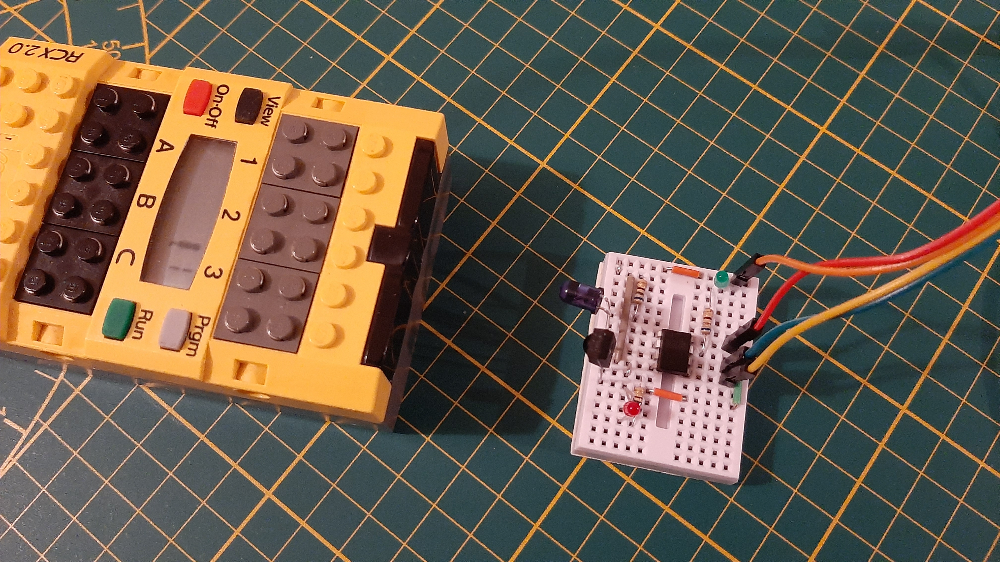
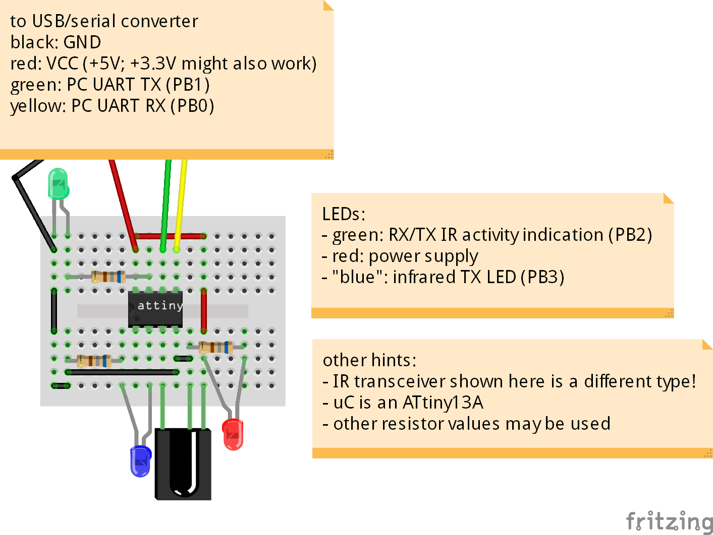
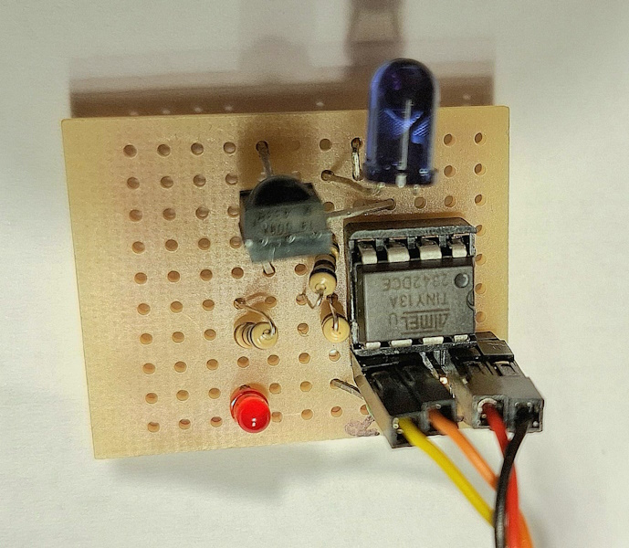
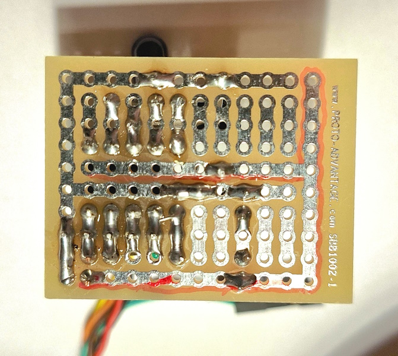
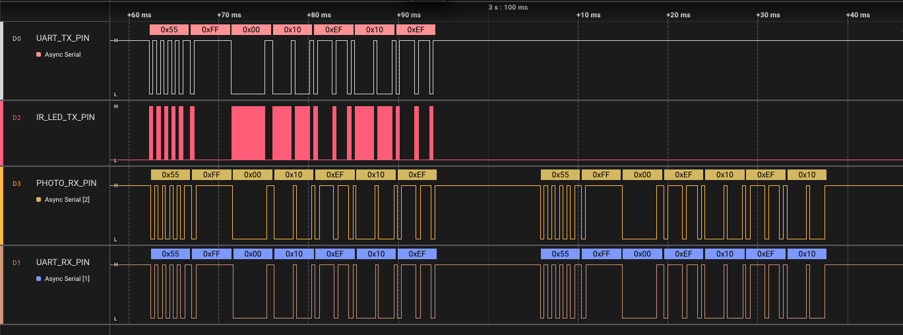
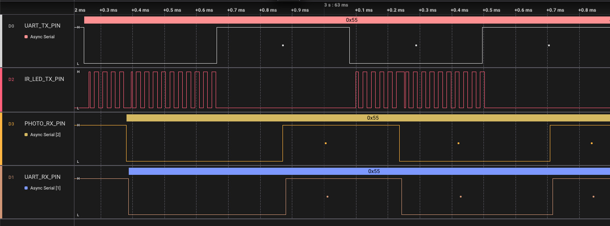

# README

Can be used as a replacement of the original LEGO IR serial tower with programs and platforms such as

* [WebPBrick](https://www.webpbrick.com): web-based NQC IDE (see also: [github.com/maehw/WebPBrick/](https://github.com/maehw/WebPBrick/))
* [Bricx Command Center (BricxCC)](https://bricxcc.sourceforge.net/): 32-bit Windows IDE
* `firmdl3` command line download tool
* probably other software

to **load user programs and firmware** on the yellow LEGO Mindstorms RCX programmable brick.



## Hardware

> ⚠️ **Warning**: Exposure to infrared light can cause harm to humans. Prolonged or intense exposure may lead to damage to the eyes or skin. Always use proper safety equipment when working with infrared light sources. Make sure to limit the current through the infrared TX LED!

### Pin Assignment

Pin Assignment Table for the ATtiny13A:

| IC Pin | Pin    | Purpose              | Direction | Side of IC | ISP Usage |
|--------|--------|----------------------|-----------|------------|-----------|
| 1      | PB5    | Reset                | Unused    | Left       | Reset     |
| 2      | PB3    | IR_LED_TX_PIN        | Output    | Left       |           |
| 3      | PB4    | PHOTO_RX_PIN         | Input     | Left       |           |
| 4      | GND    | Ground               | -         | Left       | GND       |
| 5      | PB0    | UART_RX_PIN          | Output    | Right      | MOSI      |
| 6      | PB1    | UART_TX_PIN          | Input     | Right      | MISO      |
| 7      | PB2    | IR_ACTIVITY_LED_PIN  | Output    | Right      | SCK       |
| 8      | VCC    | Supply Voltage (VCC) | -         | Right      | VCC       |

The column "ISP Usage" shows what pins need to be connected for programming ("flashing") by a 6-pin AVR _In-System Programmer_ (ISP).

### Parts

- ATtiny13A as microcontroller (calibrated internal 9.6 MHz oscillator as clock source; other uCs such as the ATtiny85 _may_ work as they have more SRAM and more flash memory, but timing values will need to be adjusted)
- Vishay Semiconductors TSOP4338 38 kHz infrared receiver (others 38 kHz infrared receivers _may_ work)
- Vishay Semiconductors TSAL6200 940 nm infrared TX LED (others 940 nm infrared TX LEDs _may_ work)

### Breadboard or PCB

For breadboard see image above. The Fritzing breadboard diagram looks as follows (please also pay attention to the hints inside the image):



An alternative would be a solder breadboard to make something semi-permanent (the green activity LED is hidden between the jumper wires of the USB/serial converter cable):






## Firmware

Find the productive firmware in folder `./firmware`.

### Prerequisites

- GNU C cross compiler for AVR 8-bit `gcc-avr` (other build toolchains *may* work as well)
- `avrdude`: program for downloading and uploading the on-chip memories of AVR microcontrollers (or another similar tool)

### Build

To build, run:

```shell
avr-gcc -g -Wall -Os -mmcu=attiny13a -o main.elf main.c
```

(Append the verbosity flag `-v` to see what's going on behind the scenes.)


Want to check if it will it fit into the internal flash?

```shell
avr-size main.elf
   text	   data	    bss	    dec	    hex	filename
    776	      0	      7	    783	    30f	main.elf
```


Make sure to burn the microcontrollers fuses so that

- the calibrated internal 9.6 MHz oscillator is selected
- clock pre-scaler set to 1 (device is shipped with CKDIV8 programmed).


Reading fuses with avrdude (and in this case an `ehajo-isp` in-system programmer):

```shell
avrdude -c ehajo-isp -p t13a -U hfuse:r:-:h -U lfuse:r:-:h
```

The default values for the two fuse bytes of the ATtiny13A are `0xff` (high), `0x6a` (low).  The required settings however are: `0xff` (high), `0x7a` (low). Writing fuses with avrdude:

```shell
avrdude -c ehajo-isp -p t13a -U hfuse:w:0xff:m -U lfuse:w:0x7a:m
```

(Hint: If the `avrdude` version being used gives *"avrdude: AVR Part "t13a" not found."*, try using `t13` instead of `t13a`.)


Finally, flash the firmware:

```shell
avrdude -c ehajo-isp -p t13a -U flash:w:main.elf:e
```


### Test firmware

Please note that under `./test/firmware`, there's some more code to test the assembled hardware. The commands from above can be reused, only the filename needs to be changed.


`blink.c` will blink the activity indication LED and hence allow to check if the LED is working and the compilation and flashing also works.


`pulsed_ir_tx.c` will blink the activity indication LED and also transmit modulated infrared light at 38 kHz for 0.5 seconds and then switch the transmitter off for another 0.5 seconds. This allows to check if the fuse bytes have been set correctly or the blinking is way slower and the default `CKDIV8` may not have been overwritten.


`serial_echo.c` will echo the serially received UART characters. Please note that this example does not make use of any uC UART peripheral but only relies upon GPIO pin edge detection on the "UART" receive pin. This can be used with any terminal emulator that works with serial devices or with the Python script `/test/scripts/serial_coms.py` to send and receive binary data:

```shell
$ python serial_coms.py -h
usage: serial_coms.py [-h] serial_device data_to_send

Send binary data over serial and receive response.

positional arguments:
  serial_device  Name of the serial device (e.g., '/dev/ttyUSB0')
  data_to_send   Binary data to send in HEX format (e.g., '55FF00609F609F')

options:
  -h, --help     show this help message and exit
```

Example:

```shell
$ python serial_coms.py /dev/ttyUSB0 11223344
[TX] 11 22 33 44 
[RX] 11 22 33 44
```

The same four bytes are received which have been transmitted before - just as you'd expect from an echo application!


## Design details

The following timing diagram shows four signals from top to bottom:

* UART_TX_PIN: the UART transmit (=TX) signal - as sent by the PC, coming from the USB/serial converter
* IR_LED_TX_PIN: the modulated infrared transmit signal on the IR TX LED, on–off keying (OOK) modulated at 38 kHz, 38 kHz carrier is _active_ during _low_ periods of UART_TX_PIN
* PHOTO_RX_PIN: the signal on the (already demodulated) infrared receiver
* UART_RX_PIN: the UART receive (=RX) signal - as sent by the DIY IR tower to the USB/serial converter



The diagram shows the message `0x55 0xFF 0x00 0x10 0xEF` 0x10 0xEF being sent from the PC to the RCX (first half). It also shows the response from the RCX to the PC: `0x55 0xFF 0x00 0xEF 0x10 0xEF 0x10` (second half). In the first half one can also see that the signal transmitted by the DIY IR tower is reflected and directly received by itself. This is due to the arrangement of IR TX LED and IR receiver - and afair can also be seen with the original IR towers. This "echo effect" must/can be handled in software!

Zooming in (less time for the same screen width) reveals the delays between the signals:




## Disclaimer

LEGO® is a trademark of the LEGO Group of companies which does not sponsor, authorize or endorse this project.
